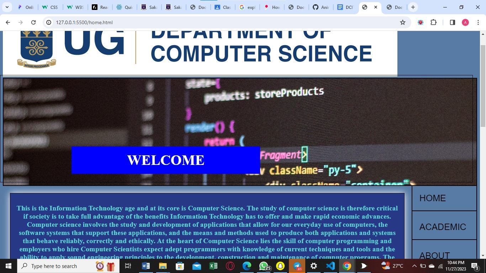
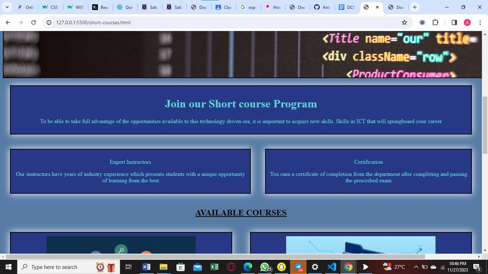
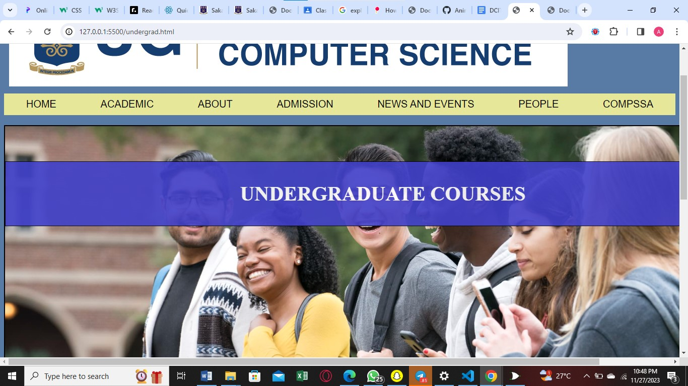
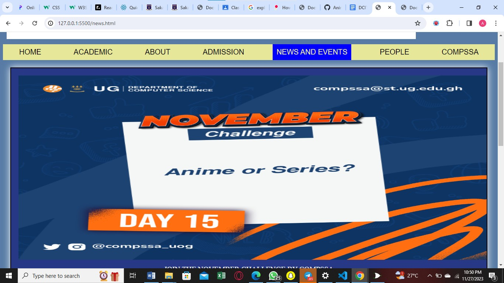
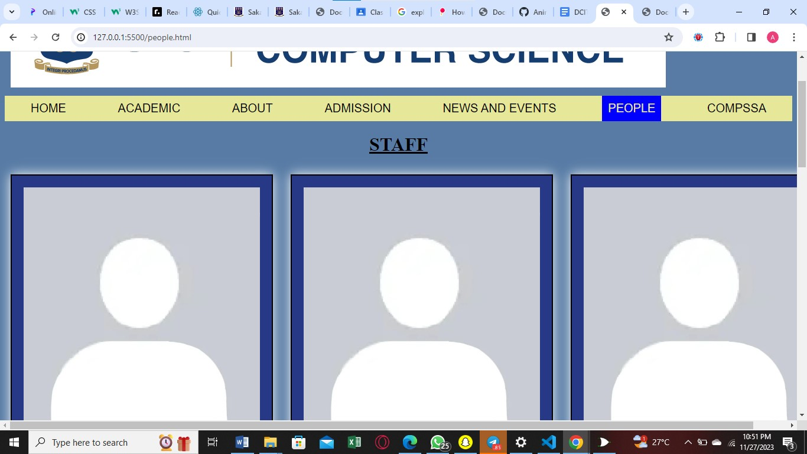
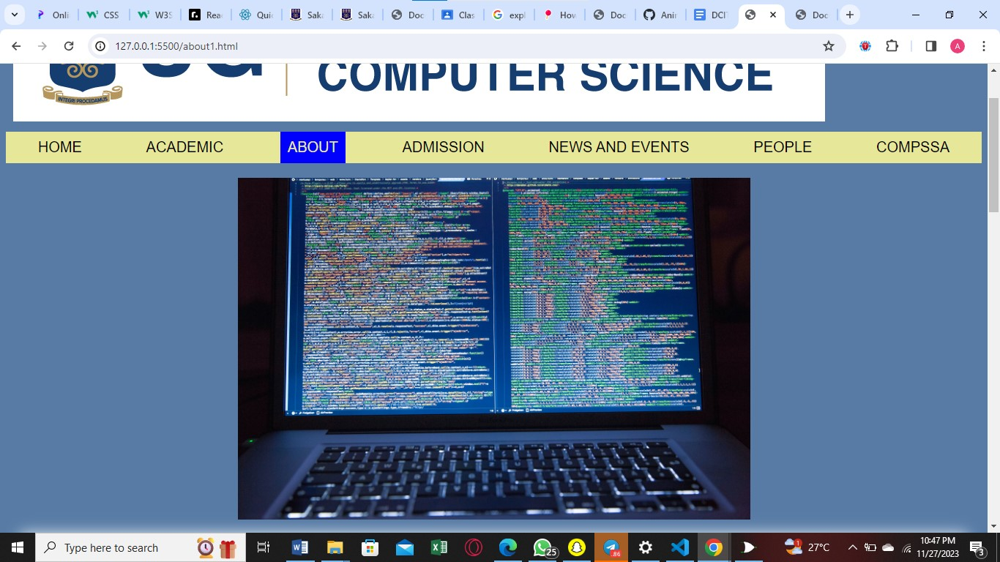
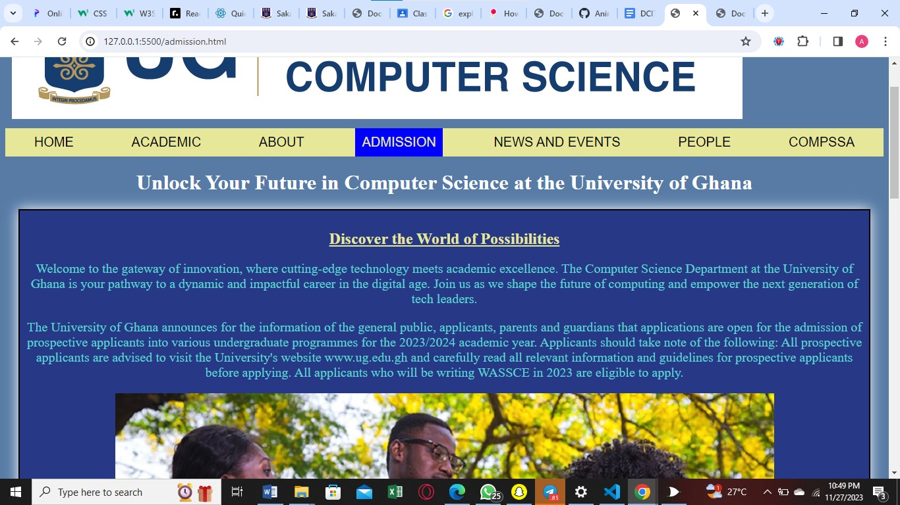
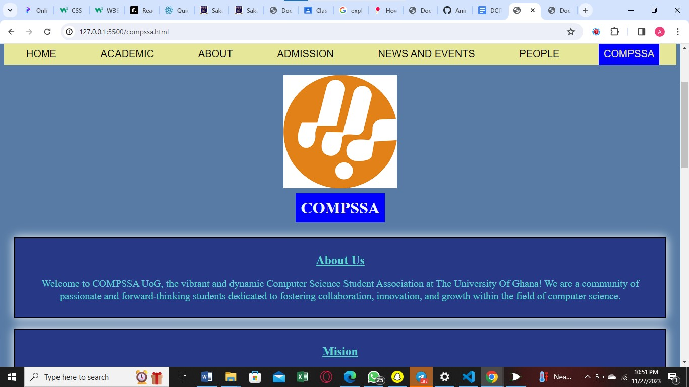
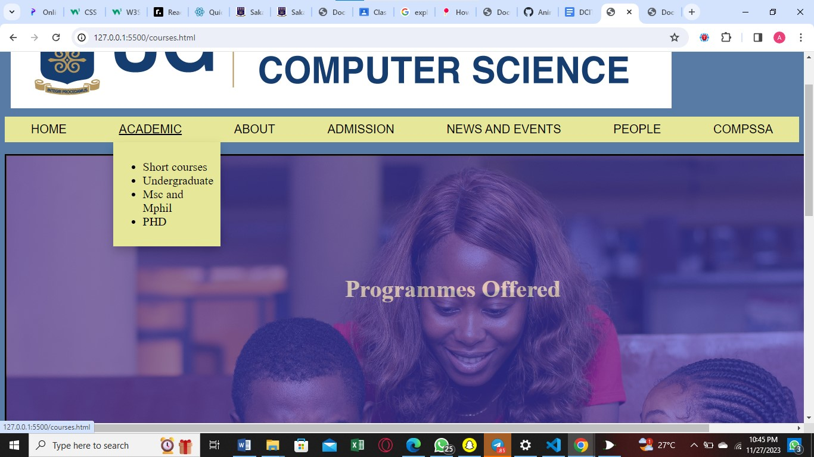

# DCIT_205_IA
# Introduction and purpose of designing the Computer Science Department Website

The website is created for the  computer science department , a comprehensive online platform designed to serve as a dynamic hub for students, faculty, and enthusiasts within the exciting realm of computer science. The ten-page website for the Computer Science Department is meticulously designed to serve as a central information hub for academic programs, faculty, research, and events. it aims to offer valuable insights, and inspire individuals within the dynamic field of computer science.

## Steps to clone and set up a project

# Here are the steps to clone and set up a project:

1.	Open your terminal or command prompt.
2.	Navigate to the directory where you want to clone the project.
3.	Copy the URL of the project repository you want to clone.
4.	Type git clone followed by the URL you copied in step 3.
5.	Press Enter to create your local clone.
6.	Install any dependencies required by the project.
7.	Run the project using the appropriate command.

## Name and Student ID
name: Muhammed Aminu Umar
Student ID: 11357693

### Screenshot of various pages

  
  

### What I learned from this project

From the project ,I have learned some html and css skills .Some of the things I learnt in html are the div , sub and sup tags and also the proper structuring of codes .I learnt a lot of css styles such as padding ,margin, background colors ,etc.I also learnt different ways of calling selectors to apply styles on them .Calling an id with # , calling a class with the . ,calling multiple classes or ids,etc .I have really learnt a lot from this project despite there are still more to learn.

